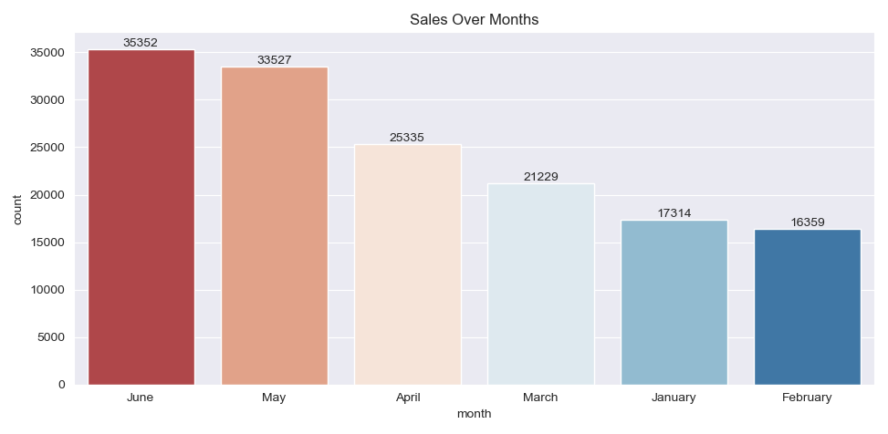

# Coffee Shop Sales Analysis EDA

Putting the sensitive nature of the topic aside, analyzing mortality data is essential to understanding the complex circumstances of death across the country. The US Government uses this data to determine life expectancy and understand how death in the U.S. differs from the rest of the world. Whether you’re looking for macro trends or analyzing unique circumstances, we challenge you to use this dataset to find your own answers to one of life’s great mysteries.

## Analysis & Visualizations
* Discovering transaction_date column
* Extract some information such as year , month and day
* see number of transaction in each month

## Visualizition Analysis

*A bar plot focusing on the sales. Most sales within a six-month period*

