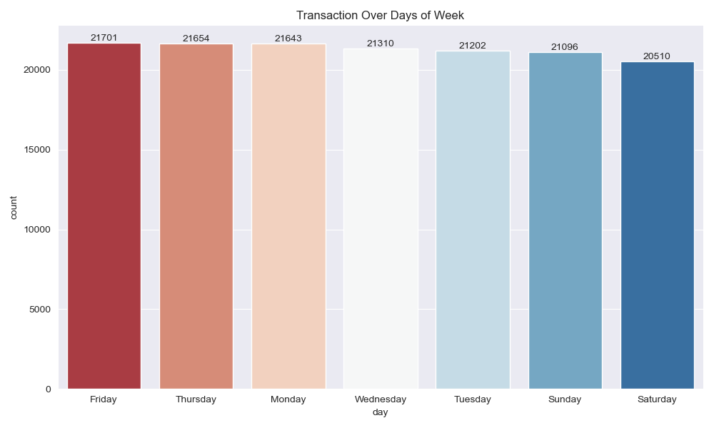
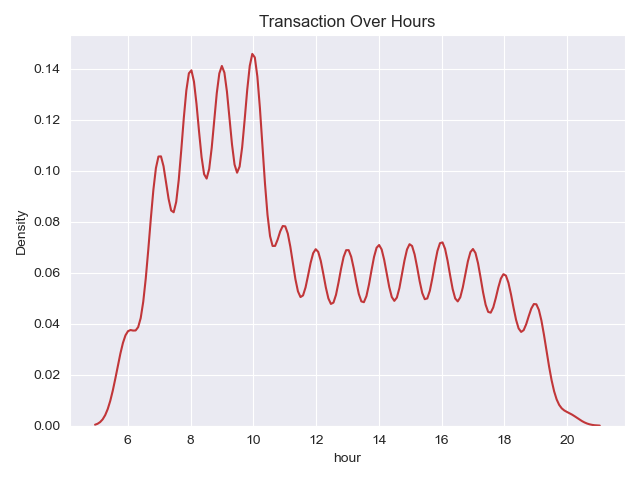
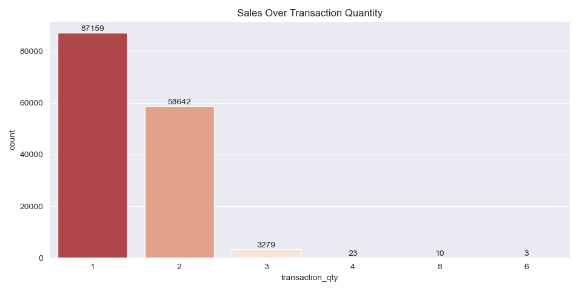
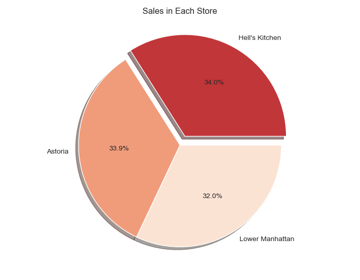
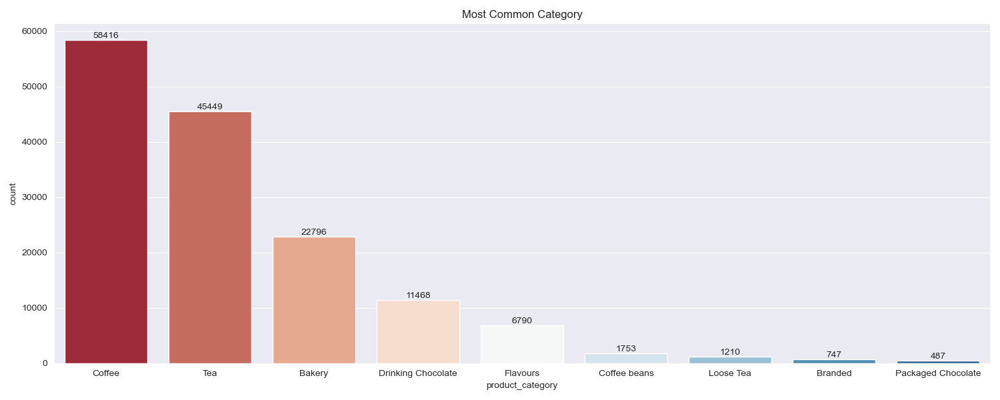
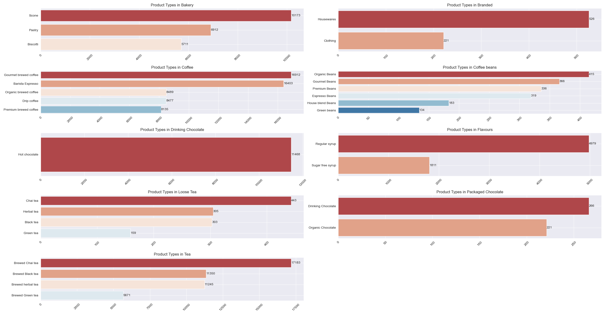

# Coffee Shop Sales Analysis EDA

Putting the sensitive nature of the topic aside, analyzing mortality data is essential to understanding the complex circumstances of death across the country. The US Government uses this data to determine life expectancy and understand how death in the U.S. differs from the rest of the world. Whether you’re looking for macro trends or analyzing unique circumstances, we challenge you to use this dataset to find your own answers to one of life’s great mysteries.

## Analysis & Visualizations
* Discovering transaction_date column
* Extract some information such as year , month and day
* Transaction in each month
* Transaction in each day of week
* Transaction in each hour
* Sales over different Transaction Quantities
* Sales in Each Store
* Most Common Category

# Visualizition Analysis

*A bar plot focusing on the Transactions over months.*

*A bar plot focusing on the Transactions over days of week.*

*A bar plot focusing on the Transactions over hours. Most sales were from 7 AM to 11 AM*

*A bar plot focusing on the sales over transaction quantities. Most sales were singles followed by 2 lots*

*A pie plot focusing on the sales for each store. The sales rates of the three stores were similar, with the most significant difference observed at the Hell's Kitchen store*

*A bar plot focusing on the most common products. Coffee stands as the best-selling product. Tea also exhibits a high sales rate.*

