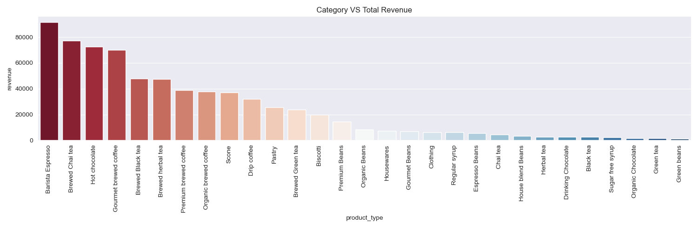

# Sales Analysis Template-EDA
Creating a template for Basic EDA on any datasets. Here we demonstrate a simple EDA on a coffee shop data.

Analyze sales trends over time, discover peak days, and identify top-selling products driving business revenue. Perfect for EDA enthusiasts and coffee connoisseurs. ☕📈 
#CoffeeSales #DataAnalysis #EDA

## Analysis & Visualizations
* Discovering transaction_date column
* Extract some information such as year , month and day
* Transaction in each month
* Transaction in each day of week
* Transaction in each hour
* Sales over different Transaction Quantities
* Sales in Each Store
* Most Common Category
* Most Common Product in Each Category
* Category VS Total revenue

# Visualizition Analysis

*A bar plot focusing on the Transactions over months.*

*A bar plot focusing on the Transactions over days of week.*

*A bar plot focusing on the Transactions over hours. Most sales were from 7 AM to 11 AM*

*A bar plot focusing on the sales over transaction quantities. Most sales were singles followed by 2 lots*

*A pie plot focusing on the sales for each store. The sales rates of the three stores were similar, with the most significant difference observed at the Hell's Kitchen store*

*A bar plot focusing on the most common products. Coffee stands as the best-selling product. Tea also exhibits a high sales rate.*

*A bar plot focusing on the most common products. Coffee stands as the best-selling product. Tea also exhibits a high sales rate.*

Top Revenue Product Types :
* Barista Espresso with a revenue of 91,406.20
* Brewed Chai tea with a revenue of 77,081.95
* Hot chocolate with a revenue of 72,416.00
* Gourmet brewed coffee with a revenue of 70,034.60
* Brewed Black tea with a revenue of 47,932.00
 

Lowest Revenue Product Types :
* Organic Chocolate with a revenue of 1,679.60
* Green tea with a revenue of 1,470.75
* Green beans with a revenue of 1,340.00
 

Other Observations :
* Various products contribute to revenue across different ranges, with a mix of beverages (like teas, coffees) and snacks (biscotti, pastries).
* Coffee-related products, such as various brews and espresso variants, hold prominent positions in revenue generation.
* The lowest revenue-generating products are predominantly related to tea and specific beverage variants.

